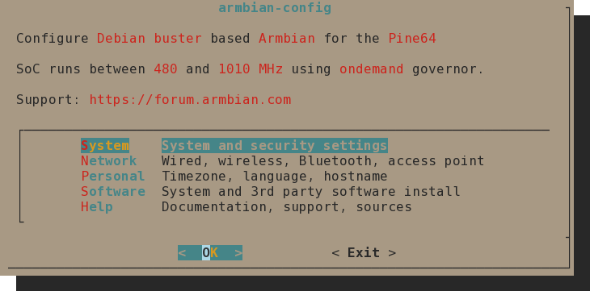
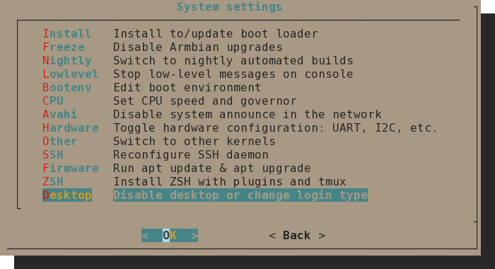

# Armbian

!!! attention
    Due to still not having official support in Armbian,
    if you update the system, with `apt upgrade` or using `armbian-config`,
    you most likely will break the system and not be able to boot again,
    due to changes in the kernel.

## Changing Armbian configurations

Armbian has a run time utility that can be used to change some of its configurations easily,
using a [TUI](https://en.wikipedia.org/wiki/Terminal_user_interface),
the [armbian-config](https://docs.armbian.com/User-Guide_Armbian-Config/) command utility.

### Enabling/Disabling the Desktop Environment

To enable/disable the Desktop Environment in Armbian,
you need to run `armbian-config` and then go to
**System** then **Desktop**.

