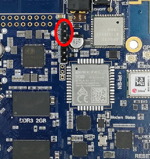
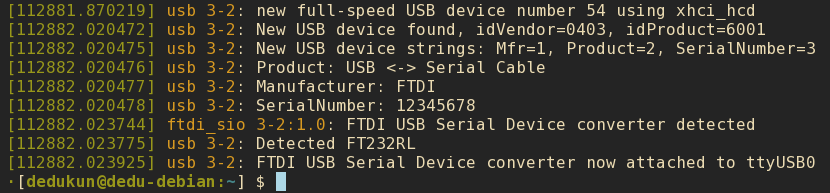
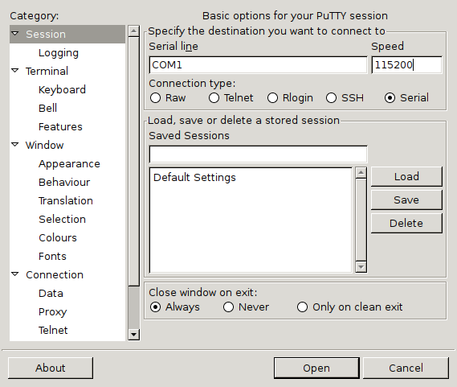
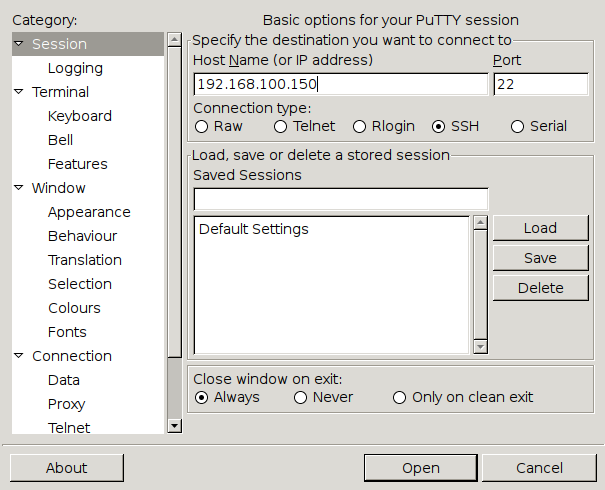

The WiiPiiDo comes by default deployed with an [Armbian](https://www.armbian.com/) image,
that was customized to fully support all of the WiiPiiDo components.

Through Armbian, the WiiPiiDo can be used either as a desktop-alike computer,
or as a server.
This way, it is possible to use the WiiPiiDo in the following ways:

- [Using the console through the serial port](#connect-through-the-serial-interface)
- [Using the console through SSH](#connect-through-ssh)
- [Using a desktop environment through HDMI](#connect-with-hdmi)

!!! note
    Independently of the method used to use the board, the login credentials are:

    - **username:** pi
    - **password:** wiipiido

## Connect through the Serial Interface

To connect to the console using the serial interface,
<!-- TODO put link to one USB-to-Serial -->
you need to have a USB to Serial connector,
by connecting it from the host PC's USB port to the WiiPiiDo's Serial
connection highlighted in the following image:



The WiiPiiDo baud rate is set to *115200*, so, once connected
to Linux machine, you can use for example the [picocom](https://linux.die.net/man/8/picocom) program
to open the serial console:

```bash
$ picocom -b 115200 <serial_port>
```

!!! info

    The `<serial_port>` is the port being used by the USB to Serial connector.

    You can check this by, after connecting the connector to the PC, using the command `dmseg`
    and see in which port the device was connected.

    

    In this example, we can see that a port was connected to the **ttyUSB0** port.
    As such, in this case, the picocom command would be `#!bash picocom -b 115200 /dev/ttyUSB0`.

In Windows, [Putty](https://putty.org) can be used for this effect as well.

In this case, make sure that you are using **Serial** as the **Connection type**.
Once the **Serial line** and **Speed** are with the correct values,
you can start the serial connection by clicking in the **Open** button.



## Connect through SSH

To connect to the WiiPiiDo through SSH you first need to know its IP address.
This can be found by either using a network scanner program, like [Fing](https://www.fing.com/),
or by configuring the WiiPiiDo to have a static and known IP,
when connected to it using the serial connection or using the HDMI output.

When the IP address is known, you can login to the WiiPiiDo, in a Linux machine by using the following command
`#!bash ssh pi@<wiipiido_ip_address>`.

Alternately, in Windows, you can, for example, use once again use [Putty](https://putty.org).

This time, make sure that you are using **SSH** as the **Connection type**,
and that the port is **22**.



## Connect with HDMI

To use the WiiPiiDo with a desktop environment,
you need to connect use the HDMI output ([label 6 in the board layout](index.md#board-layout)).
