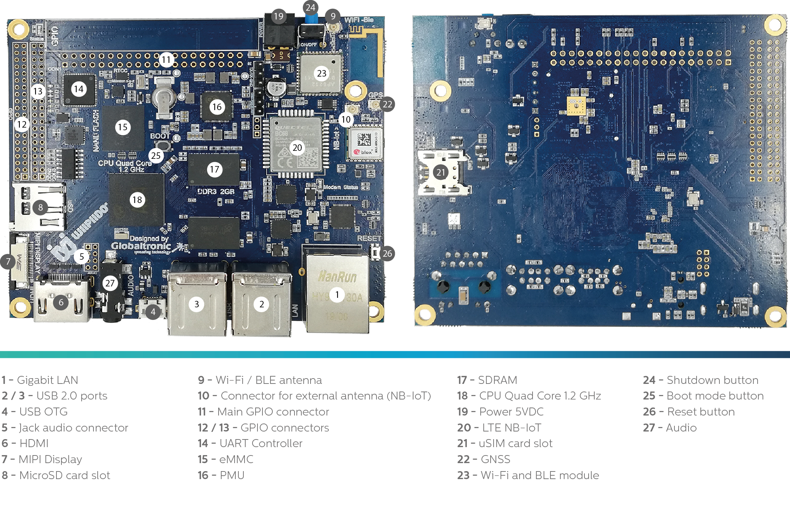
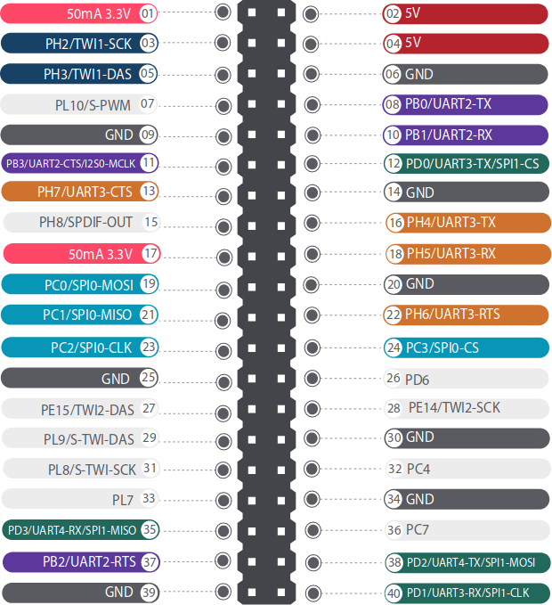
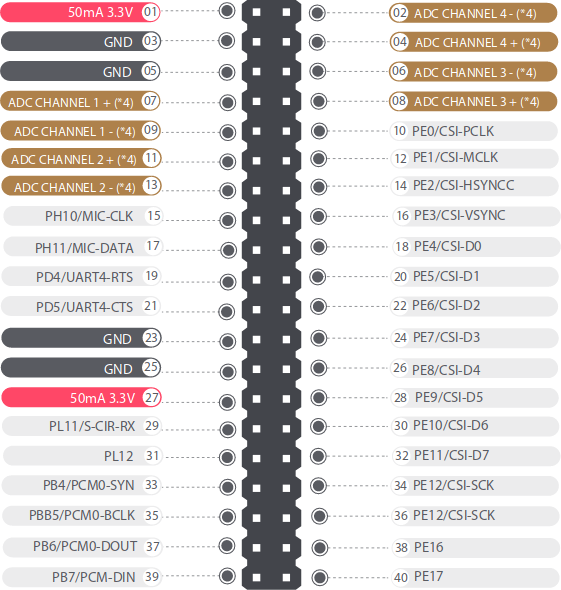
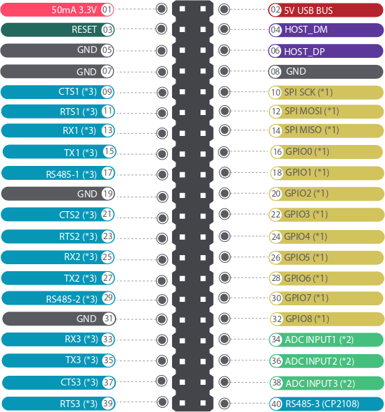

Welcome to the documentation for the [WiiPiiDo](http://www.globaltronic.pt/en/product/wiipiido/).

!!! warning
    This documentation is still a Work-in-Progress, some critical information may still be missing.
    If there is something that you would like to have here that is still missing,
    please fill a issue [here](https://github.com/globaltronic/wiipiido-docs/issues).

## What is the WiiPiiDo?

The WiiPiiDo is a compact and high-performance single-board computer.

## The board layout

## Headers Pin out

The WiiPiiDo has 3 headers, label as **11**, **12** and **13** in the board layout.

The pin out for these headers is the following:

| Header                                              | Pin out                                                                      |
|:---------------------------------------------------:|:----------------------------------------------------------------------------:|
| Main Header (RPI-Compatible) **(label 11)** |  |
| Header 2 **(label 12)**                         |        |
| Header 3 **(label 13)**                         |        |

## Contact

For more information, please contact us directly by phone at ***(+351) 234 612 687***,
or send an email to <geral@globaltronic.pt>.
